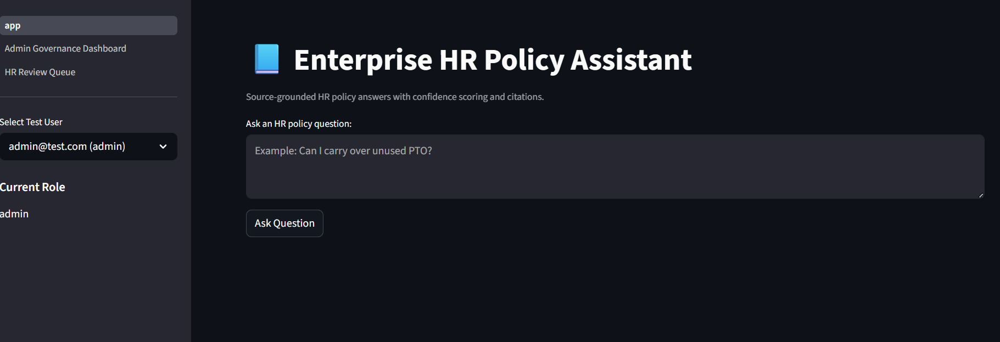
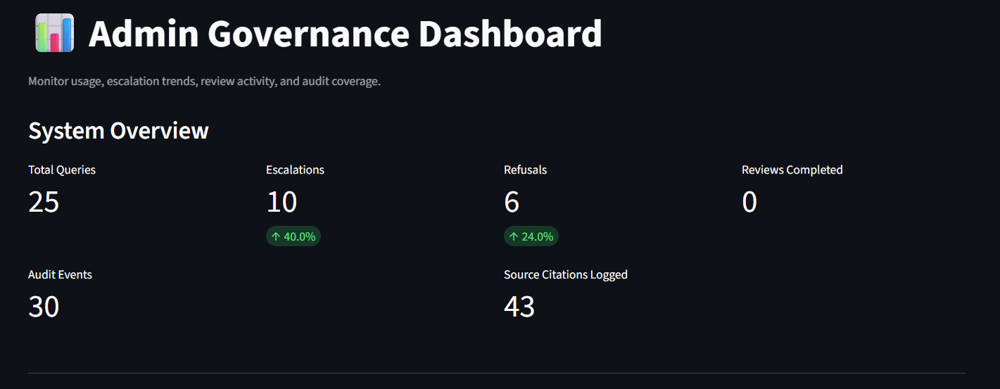
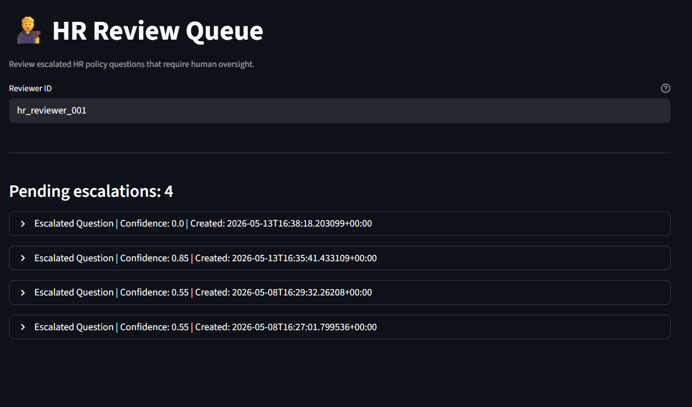
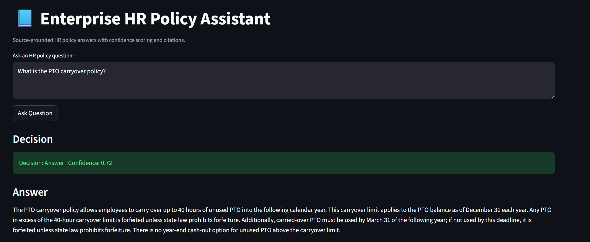
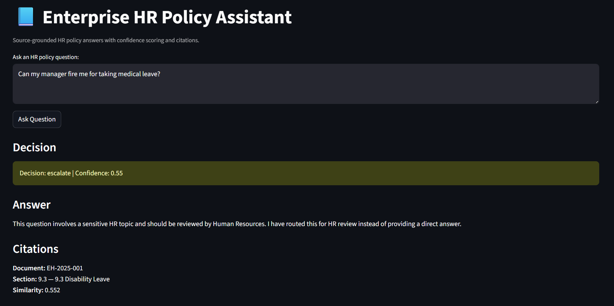
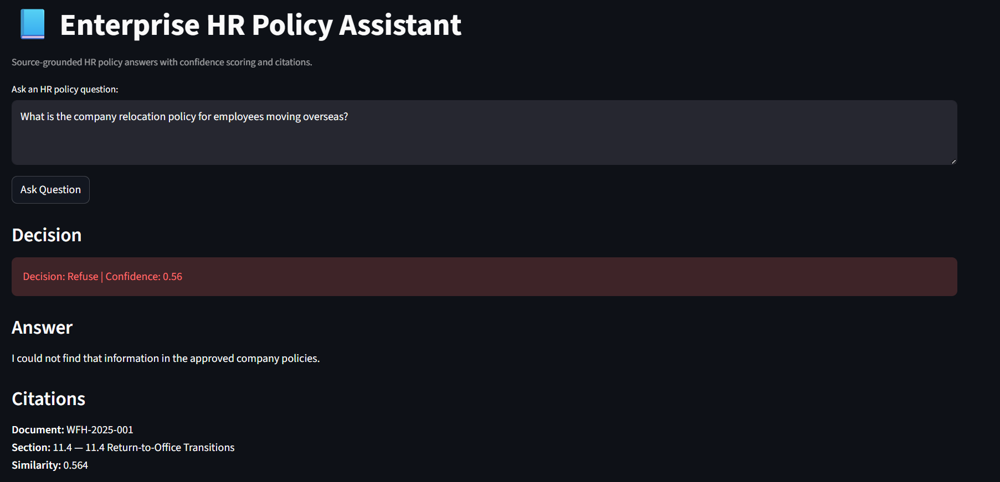
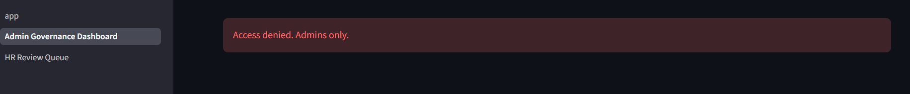
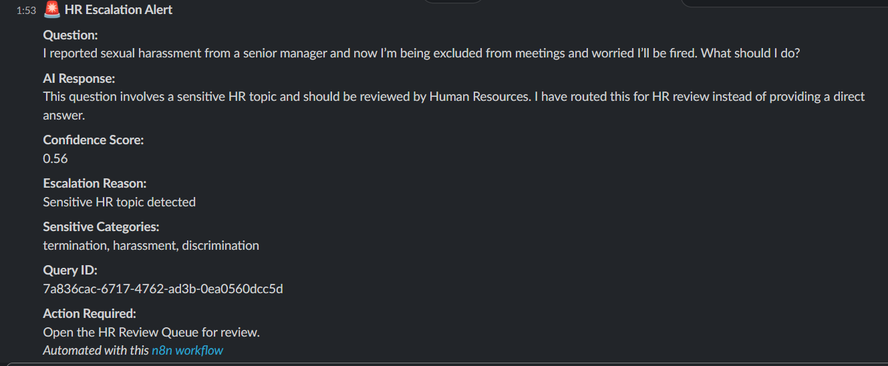
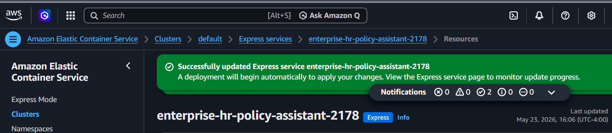

# Enterprise HR Policy Assistant

Governed AI-powered HR policy assistant built with Retrieval-Augmented Generation (RAG), workflow automation, audit logging, escalation handling, and cloud deployment on AWS.

---

## Overview

This project simulates an enterprise HR policy support system designed to safely answer employee HR policy questions using source-grounded retrieval, confidence scoring, governance controls, and human review workflows.

The system supports three decision outcomes:

- **Answer** → Returns a grounded response with citations
- **Escalate** → Routes sensitive or low-confidence questions for HR review
- **Refuse** → Blocks unsupported or unsafe requests

The platform includes audit logging, review queues, operational dashboards, workflow orchestration, and cloud deployment using Docker and AWS ECS.

---

## Features

### AI & Retrieval

- OpenAI-powered HR policy assistant
- Retrieval-Augmented Generation (RAG)
- Embeddings + vector search
- Source-grounded responses with citations
- Confidence scoring

### Governance & Safety

- Prompt injection detection
- No-source refusal logic
- Sensitive topic escalation
- Human-in-the-loop review workflows
- Role-based access concepts (RBAC)
- Audit logging and traceability

### Workflow Automation

- Slack escalation notifications
- Operational workflow routing
- Structured outputs and schema validation
- Review queue workflows
- Dashboard analytics

### Cloud Deployment

- Docker containerization
- Amazon ECR image management
- AWS ECS deployment
- Environment variable configuration
- Production-style cloud hosting

---

## Tech Stack

### Backend

- Python
- FastAPI
- OpenAI API

### Frontend

- Streamlit

### Database & Storage

- Supabase
- PostgreSQL
- Vector embeddings

### Automation & Notifications

- n8n
- Slack

### Cloud & DevOps

- Docker
- AWS ECS
- Amazon ECR
- GitHub

---

## Architecture

```text
Employee → Streamlit UI → FastAPI → OpenAI + Vector Search
                                  ↓
                         Governance Logic
                                  ↓
                Answer | Escalate | Refuse
                                  ↓
            Audit Logs + HR Review Queue + Slack
```

---

## Key Governance Controls

- Confidence threshold evaluation
- Escalation routing
- Prompt injection detection
- No-source refusals
- Structured output validation
- Human review workflows
- Audit event tracking

---

## Screenshots

### Main HR Assistant UI



---

### Governance Dashboard



---

### HR Review Queue



---

### Answer Workflow



---

### Escalation Workflow



---

### Refusal Workflow



---

### RBAC / Governance View



---

### Slack / n8n Escalation Workflow



---

### AWS Deployment



---

## Example Decision Flow

### Answer

- High confidence
- Valid policy citations
- Grounded response returned

### Escalate

- Sensitive HR topics
- Low confidence responses
- Human review required

### Refuse

- Unsupported requests
- Missing policy evidence
- Prompt injection attempts

---

## Evaluation Testing

Created evaluation test cases validating:

- Answer routing
- Escalation behavior
- Refusal logic
- Audit logging
- Governance consistency
- Citation handling

---

## Project Goals

This project was built to demonstrate:

- Business systems analysis
- Workflow automation
- AI governance concepts
- Human-in-the-loop operations
- Cloud deployment workflows
- Operational observability
- Enterprise process thinking

---

## Future Improvements

- Authentication and user management
- Enhanced RBAC enforcement
- Expanded HR policy coverage
- Additional monitoring and analytics
- CI/CD pipeline integration
- Production database hardening

---

## Author

Dennis Hanton

LinkedIn: https://www.linkedin.com/in/dennishanton/

GitHub: https://github.com/dennishanton0124-del